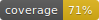
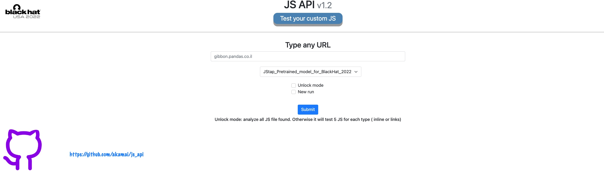
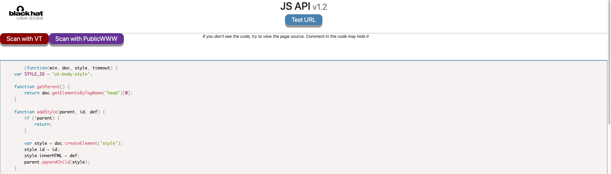

[](https://GitHub.com/Naereen/StrapDown.js/graphs/commit-activity)
[](http://perso.crans.org/besson/LICENSE.html)


# JS API

_Presented
at [BlackHat USA 2022 Arsenal](https://www.blackhat.com/us-22/arsenal/schedule/#protecting-your-crypto-asset-against-malicious-js-phishing-27713
)_



# Table of Contents

1. [Download and getting started](#Download-and-getting-started)
2. [The 2 Web Server components](#The-2-Web-Server-components)
    1. [Model](#Model)
    2. [Metadata](#Metadata)
3. [Web server mode](#Web-server-mode)
   1. [Scan url](#Scan-url)
   2. [Scan JS](#Scan-JS)
   3. [API](#API)
4. [Deployment with docker to a cloud web service](#Deployment-with-docker-to-a-cloud-web-service)
5. [Support and contributing to JS API](#Support-and-contributing-to-js-api)

# Download and getting started

First of all, clone the repo :)

## The quick way - Docker

The quicker way as (almost) always is to run a docker.

You can use the one I uploaded to docker Hub to quicky start

```shell
docker run -it -p 8080:8080 --name js_api jordanaka/js_api_image
```

You can also build yourself your docker by running (or if the above image is not accessible)

```shell
docker-compose up
```

Now browse to http://localhost:8080 and you should have the server up.

One little thing, if you want to get access to the metadata service, create a file credentials.json and copy it inside
the docker

```crendentials.json
{
  "PUBLICWWW": "your_publicwww_api",
  "VT": "your_vt_api_key"
}
```

```bash
docker cp credentials.json js_api:/code/credentials.json
```

Moreover this docker can be super easily deployed to a cloud service App service (Azure) or Elastic beanstalk (AWS)
Enjoy :)

## The less quick way - git clone

We are going to use the JStap model for malicious JS detection. Because I modified it a little
bit ( [JStap modifiction](#JStap-modification) ), I just uploaded it also. By the time I am write these lines (July 2022),
the last commit in JStap repo is 5e96f3019ffaa6a7799741ba597443489e19a5c3. If you want to get a more recent, make sure you clone it
and make the modifications.

Don't run the lines below unless you want to get the latest JStap version and make your changes.
```bash
cd src/models
git clone https://github.com/Aurore54F/JStap
```

Install the requirements

```bash
pip install requirements.txt
pip install src/models/JStap/requirements.txt
```

Create the file ```credentials.json``` ( if you want to use VT or PublicWWW)

```bash
python wsgi.py
```

## JStap modification ( skip if you use the code as is)

In ```classification/classifier.py```, just add a "return" statement at line 81 and 200

```python
 if print_res_verbose:
    return machine_learning.get_classification_results_verbose(names, labels, labels_predicted_test,
                                                               labels_predicted_proba_test, model,
                                                               attributes, threshold)  ##line 81
```

```python
return test_model(names, labels, attributes, model=model[0], threshold=threshold[0])  ##line 200
```

In ```classification/machine_learning.py```Replace the function get_classification_results_verbose by the below

```python
def get_classification_results_verbose(names, labels, labels_predicted, labels_predicted_proba, model, attributes,
                                       threshold):
    result = list()
    for i, _ in enumerate(names):
        result.append(((str(names[i]), str(labels_predicted[i]), str(labels_predicted_proba[i][1]))))
    return result
```

# The 2 Web Server components

## Model

Any model can be plugged to this API. We decided to use JStap since it gaves us good results.
To add new model, just inherate from the Model Class and take the existing model as an example to plug it to the webserver.

We deliver a trained model that identifies Crypto Skimmers. Those are JS files that replaces crypto addresses by attackers addresses before paying in a web page. 

Training and validations set

<table>
<tbody>
<tr style="height: 23px;">
<td style="height: 23px;">Source</td>
<td style="height: 23px;">Unique hash (k)&nbsp;</td>
<td style="height: 23px;">Label</td>
<td style="height: 23px;">Description</td>
</tr>
<tr style="height: 23.5px;">
<td style="height: 23.5px;">&nbsp;Alexa</td>
<td style="height: 23.5px;">626</td>
<td style="height: 23.5px;">Benign</td>
<td style="height: 23.5px;">Top 500k popular website. Since this service is down now, you can use tranco&nbsp;https://tranco-list.eu/</td>
</tr>
<tr style="height: 23px;">
<td style="height: 23px;">hyneketrak</td>
<td style="height: 23px;">27</td>
<td style="height: 23px;">Malicious</td>
<td style="height: 23px;">https://github.com/HynekPetrak/javascript-malware-collection</td>
</tr>
<tr style="height: 23px;">
<td style="height: 23px;">geeksonsecurity</td>
<td style="height: 23px;">&nbsp;25</td>
<td style="height: 23px;">Malicious</td>
<td style="height: 23px;">https://github.com/geeksonsecurity/js-malicious-dataset</td>
</tr>
<tr style="height: 23px;">
<td style="height: 23px;">Lazarus&nbsp;skimmers</td>
<td style="height: 23px;">7 samples</td>
<td style="height: 23px;">Malicious</td>
<td style="height: 23px;">Can be found in ressources/lazarus_samples</td>
</tr>
</tbody>
</table>

This dataset has been splitted in 75/25 (train/validation), the model is then able to detect (with ~0FP) these 2 skimmers 

Test hash

['86807cdb3dee599ee63a8f234e7001a5638484ac97711dfc81aa367ad74636bd',
'15ac070c827fac35e7dc0652340ee811548bcbb094b4f85b89b7d99bec8c0eb5']

## Metadata

Like the models, you can your own metadata object by following how the existing ones are built: VT and PublicWWW. 



VT --> Upload the JS file to VT and wait for 20 seconds for results
PublicWWW --> Take the first 100 characters of the file and search the DB of PublicWWW


# Web server mode

Below the current abilities of the web server:

### Scan url 
Path: /

Extract all the Javascript code found in a given URL. "inlines" are the ones written within the HTML page between <script></script> tags. 
"links" are JS links in the page. 

Unlock: Test all JS found
New run: Ignore the cache if exists.

### Scan JS 
Path : /input

If you would like to test a custom JS, this mode allows to do it. After the results, you can even send it to the "Metadata" service

### API

It is possible to query the WEB service as an API, you can use this example

```python
import requests
import json
r = requests.post("http://localhost:4004/",
                  data={'text': 'akamai.com', 'models': 'JStap_Pretrained_model_for_BlackHat_2022', 'api':
                         'true'})
print(json.loads(r.text))
```

# Deployment with docker to a cloud web service

To deploy your code to any cloud service, just push your docker image, after having built it with docker-compose 
or docker build

```bash
docker build -t js_api_image .
docker tag js_api_image:latest your_docker_hub_user/js_api_image
docker push your_docker_hub_user/js_api_image  
```

Once its there, go to your favorite cloud service and within few clicks you link it to your docker image.

## Access restriction 

If you use Azure App service, you can restrict which IP access the server with this command

```bash
Add-AzWebAppAccessRestrictionRule -ResourceGroupName "your_ressource_group" -WebAppName "js-api" -Name "VPN" -IpAddress "
8.8.8.8/32,1.2.34/32" -Priority 500 -Action Allow
```

I give you this tip because the UI does not allow to give a list of subnets, you need to do it one by one there.
Other techniques can be to link it to a gateway and then put Mutual TLS Authentification there 


# Support and contributing to JS API

This code is maintained. You are welcome to ask any questions directly on Git. We will try to answer as quick as
possible.

We also invite your to contribute to this open source. Add your models, metadata, improve the UI or fix bugs. It can
be done via pull request. More details on how to pull
request [here](https://www.dataschool.io/how-to-contribute-on-github/
). Please provide basic test with your code.

## Running the tests

Adding test protect your code but also explain them to others. Make sure the project as at least 70% coverage. To check
the coverage, pip install those 2 packages

```bash
pip install coverage
pip install coverage-badge
```

and run from the main js_api directory

```bash
coverage run -m pytest
coverage report -m --omit="*/test*" --omit="*/src/models/JStap*" # optional - to see the coverage without including tests
coverage-badge -o test/coverage.svg -f # this will create the coverage badge loaded in the Readme
```

Disclaimer: I am originally not a front end developer, I apologize in advance if you see bad practices in the HTML/CSS/JS code :)
# Authors

**Author**: [Jordan Garzon]
**Acknowledgment**: [Asaf Nadler]

from [Akamai Technologies](https://www.akamai.com)

[Jordan Garzon]: https://twitter.com/JordGarzon

[Asaf Nadler]: https://twitter.com/AsafNadler

```text
                                               ____________
                                --)-----------|____________|
                                              ,'       ,'
                -)------========            ,'  ____ ,'
                         `.    `.         ,'  ,'__ ,'
                           `.    `.     ,'       ,'
                             `.    `._,'_______,'__
                               [._ _| ^--      || |
                       ____,...-----|__________ll_|\
      ,.,..-------"""""     "----'                 ||
  .-""  |=========================== ______________ |
   "-...l_______________________    |  |'      || |_]
                                [`-.|__________ll_|      Enjoy
                              ,'    ,' `.        `.      
                            ,'    ,'     `.    ____`.    
                -)---------========        `.  `.____`.
                                             `.        `.
                                               `.________`.
                               --)-------------|___________|


```


